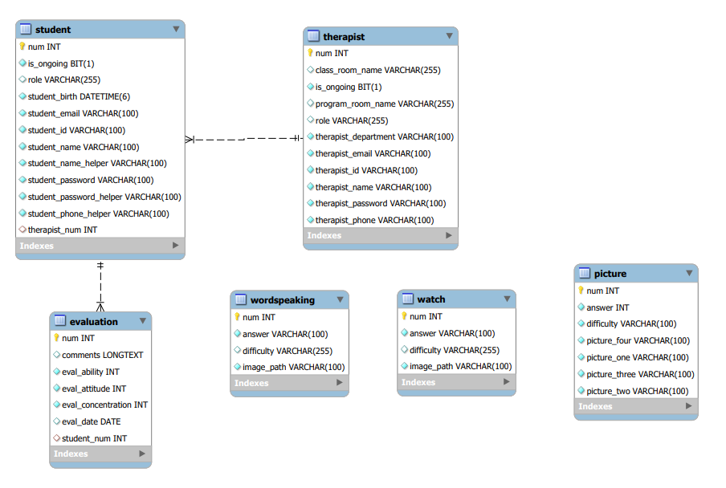
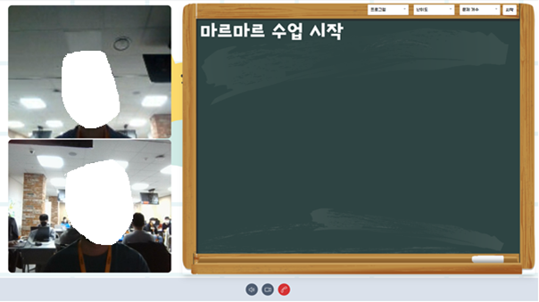
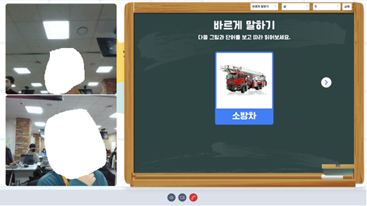
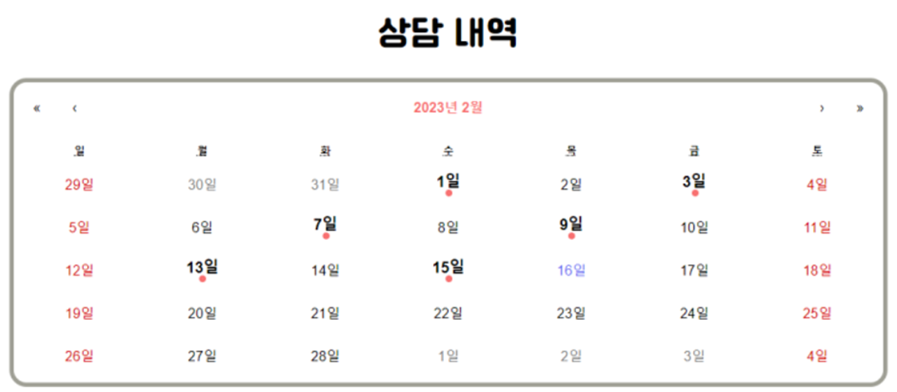
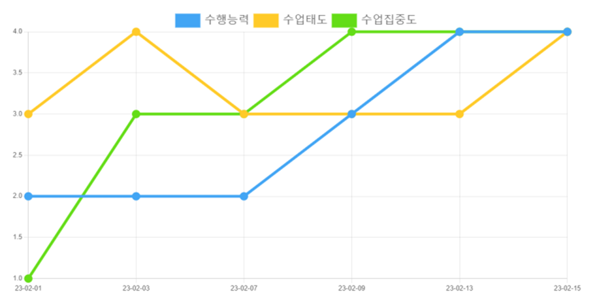
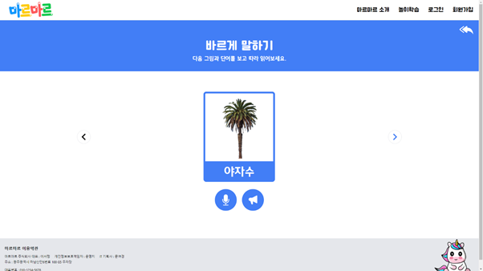
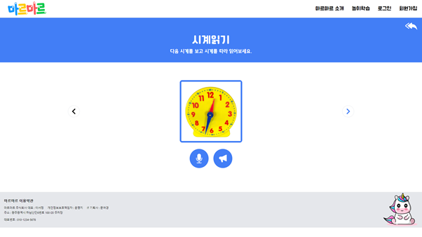
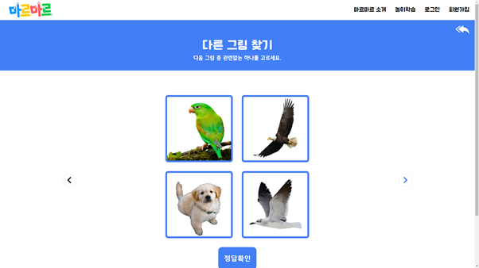

<br />

# 📢 마르마르


<br />

## 🏆 프로젝트 소개

[개요] 온/오프라인 병행가능한 언어치료 수업 플랫폼

[기간] 2023.01.03 ~ 2023.02.17 (7주)

[팀원] 이문삼, 김지애, 양동민, 윤명지, 이수아

[소속] SSAFY 8기 2학기 공통 프로젝트 (웹 기술)

[성과] 우수 프로젝트에 선정되어 우수상 수상

<br />

## 🏷 기획의도

현재 진행중인 언어치료는 대부분 온라인으로 진행되고 있습니다.  
언어치료는 온라인 수업과 오프라인 수업 모두 장단점을 명확히 가지고 있어, 이를 적절히 섞어서 활용한다면 더욱 효과적인 치료가 됩니다.  
이에 저희는 온라인과 오프라인을 병행하여 진행할 수 있는 언어치료 플랫폼을 개발하였습니다.

<br />

## 🛠️ 기술 스택 및 환경

BackEnd

- IntelliJ
- Springboot 2.7.7
- Java 11
- Node 16.18.0
- OpenVidu
- Mysql

FrontEnd

- Node 16.18.0
- OpenVidu

CI/CD

- AWS EC2 (Ubuntu 20.04 LTS)
- Docker 23.0.1
- Jenkins 2.387.1
- nginx/1.18.0

협업

- Git
- Jira
- notion
- Mattermost

<br />

## 💻 아키텍처


<br />

## 📋 요구사항 명세서


<br />

## ✔️ ERD



<br />

## 📁 프로젝트 폴더 구조

#### BackEnd

```
├─.gradle
│  ├─7.6
│  │  ├─checksums
│  │  ├─dependencies-accessors
│  │  ├─executionHistory
│  │  ├─fileChanges
│  │  ├─fileHashes
│  │  └─vcsMetadata
│  ├─buildOutputCleanup
│  └─vcs-1
├─.idea
├─gradle
│  └─wrapper
└─src
    ├─main
    │  ├─java
    │  │  └─com
    │  │      └─ssafy
    │  │          └─marmar
    │  │              ├─api
    │  │              │  ├─controller
    │  │              │  ├─request
    │  │              │  ├─response
    │  │              │  └─service
    │  │              ├─common
    │  │              │  ├─auth
    │  │              │  └─util
    │  │              ├─config
    │  │              ├─db
    │  │              │  ├─model
    │  │              │  └─repository
    │  │              └─dto
    │  └─resources
    └─test
        └─java
            └─com
                └─ssafy
                    └─marmar

```

#### FrontEnd

```
├─deploy_conf
├─public
│  ├─img
│  │  ├─background
│  │  ├─clock
│  │  ├─picture
│  │  └─word
│  ├─info
│  ├─main
│  └─modal
└─src
    ├─api
    ├─audio
    ├─components
    │  ├─common
    │  ├─home
    │  ├─Info
    │  ├─mypage
    │  │  ├─ChangeForm
    │  │  ├─deleteAccount
    │  │  ├─student
    │  │  │  ├─calender
    │  │  │  ├─myinfo
    │  │  │  └─result
    │  │  └─therapist
    │  │      ├─manage
    │  │      └─myinfo
    │  ├─navbar
    │  ├─onClass
    │  │  ├─evaluation
    │  │  └─game
    │  ├─openvidu
    │  │  ├─makeroom
    │  │  ├─student
    │  │  └─therapist
    │  ├─program
    │  ├─scroll
    │  └─user
    │      ├─findid
    │      ├─findpw
    │      ├─signin
    │      └─signup
    ├─context
    ├─hooks
    │  └─queries
    ├─libs
    └─pages
        ├─common
        ├─mypage
        ├─onClass
        ├─program
        │  ├─clock
        │  ├─picture
        │  └─word
        └─user
```

<br />

## ⭐ 주요 기능 소개

#### 1️⃣ 온라인 수업

- 마르마르 자체 프로그램으로 온라인 수업이 가능하며, 수업 중 교재 컨텐츠 사용이 가능합니다.




#### 2️⃣ 수업 진척도 확인

- 보호자는 마이페이지에서 아이의 수업 진척도, 수업평가 등을 열람가능합니다.




#### 3️⃣ 언어훈련컨텐츠

- 3가지의 종류와 3가지의 난이도로 나뉘어진 언어훈련 컨텐츠가 있습니다. 더불어, 음성 인식을 통한 학습이 가능합니다.








<br />
