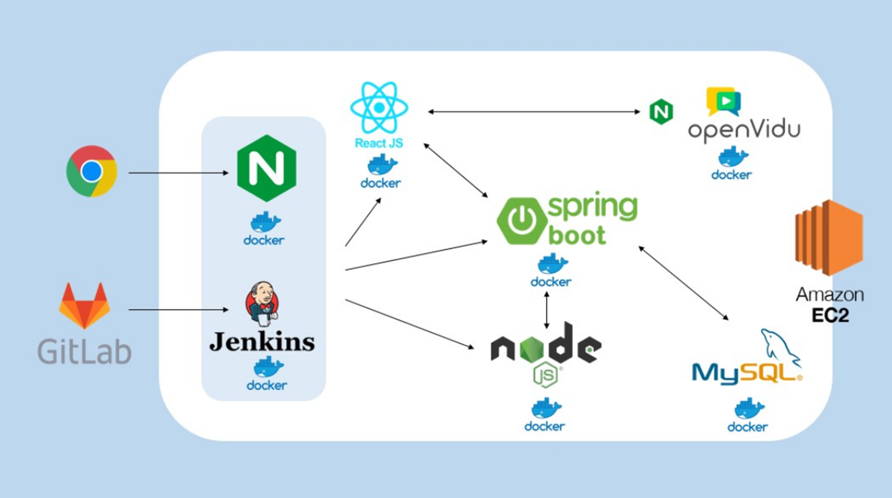
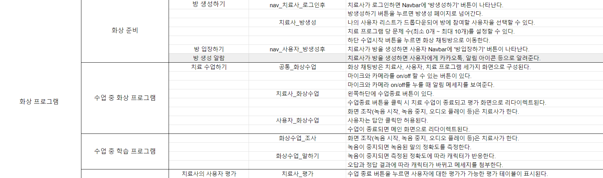
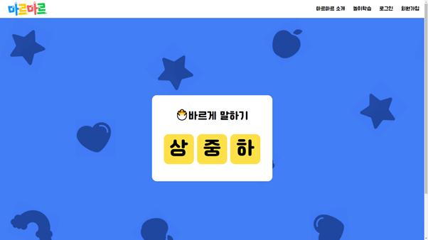
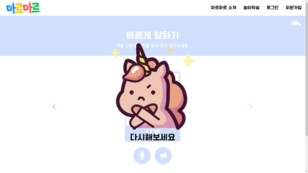
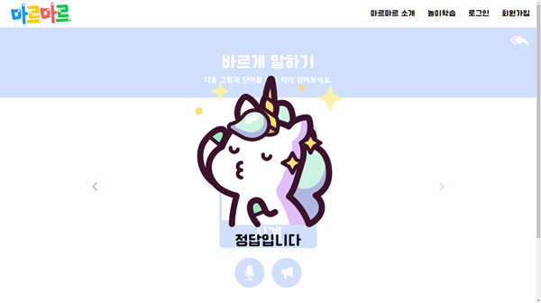

# 📢 마르마르

 

> ## 주제  
> 
[개요] 온/오프라인 병행가능한 언어치료 수업 플랫폼

> 
교육을 위한 게임 플랫폼/charjs를 통한 수업 진척도 확인/OpenVidu와 Socket.io를 통한 온라인 화상 수업을 제공하는 온/오프라인 병행 가능한 **언어치료 수업 플랫폼**입니다.

> 
[기간] 2023.01.03 ~ 2023.02.17 (7주)

> 
[성과] 우수 프로젝트에 선정되어 우수상 수상

 

> ## **팀원소개**
> - #### BE(2명) FE(3명)

| 이문삼  | 김지애  | 양동민 | 윤명지 | 이수아 |
| :----: | :----: | :-----: | :----: | :----: | 
| 👑 FE  |   FE   | FE |   BE   |   BE   |

 

## 🛠️ 기술 스택 및 환경

#### **BackEnd**
- IntelliJ
- Springboot 2.7.7
- Java 11
- Node 16.18.0
- OpenVidu
- Mysql

#### **FrontEnd**
- Node 16.18.0
- OpenVidu

#### **CI/CD**
- AWS EC2 (Ubuntu 20.04 LTS)
- Docker 23.0.1
- Jenkins 2.387.1
- nginx/1.18.0

#### **Communication Tools**
- Git
- Jira
- notion
- Mattermost

 

## 💻 아키텍처

 

## 📋 요구사항 명세서

 

## ✔️ ERD

 

> ## **기능 소개**

### 1️⃣ 온라인 수업

👀 마르마르 자체 프로그램으로 온라인 수업이 가능하며, 수업 중 교재 컨텐츠 사용이 가능합니다.

### 2️⃣ 수업 진척도 확인

👀 보호자는 마이페이지에서 아이의 수업 진척도, 수업평가 등을 열람가능합니다.

### 3️⃣ 언어훈련컨텐츠

👀 3가지의 종류와 3가지의 난이도로 나뉘어진 언어훈련 컨텐츠가 있습니다. 더불어, 음성 인식을 통한 학습이 가능합니다.

 

> ## 기대효과

### 🎉 치료 효과 향상  

온/오프라인 병행 스업으로 치료 효과 향상이 가능합니다.

### 🎉 보호자와의 유대감 형성

홈 트레이닝을 통해 보호자와 아이의 유대감 형성이 가능합니다.

### 🎉 센터와의 신뢰감 증대

화상 채팅 및 진척도 확인을 온라인에서 진행이 가능하므로 보호자와 센터간의 신뢰감 향상이 가능합니다.
